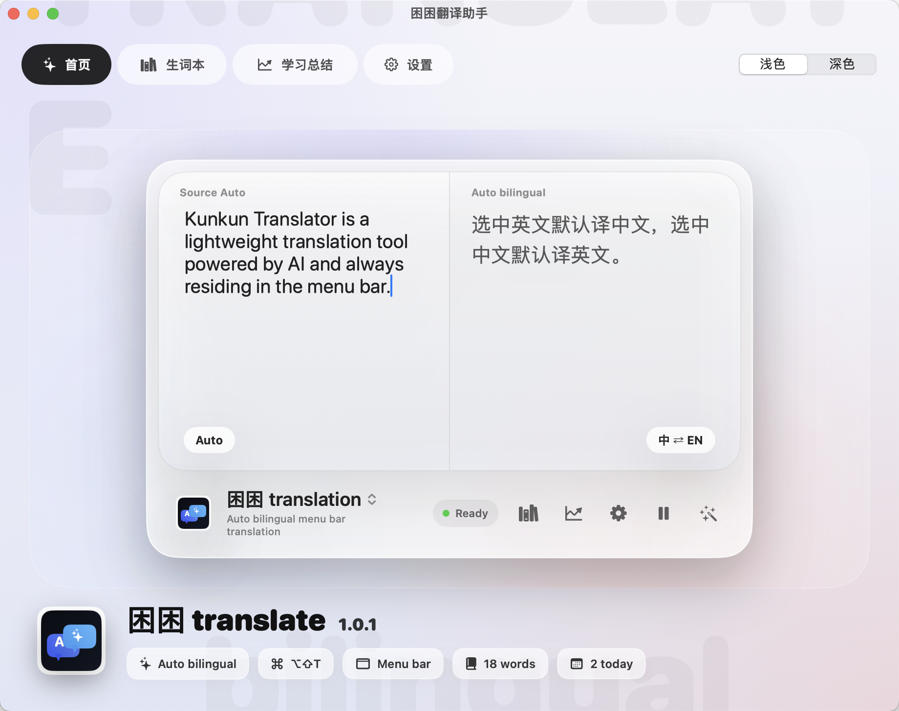
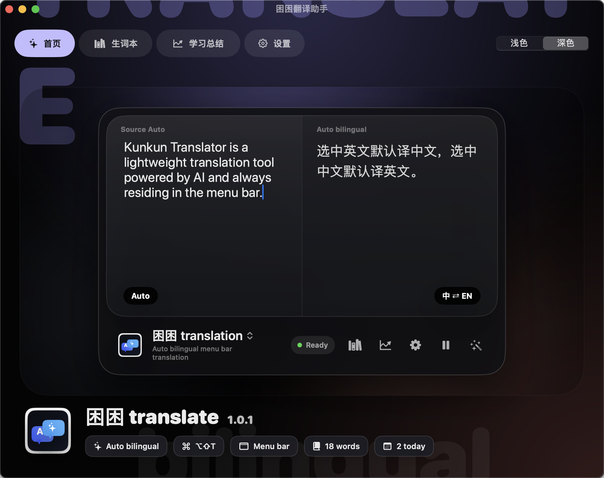
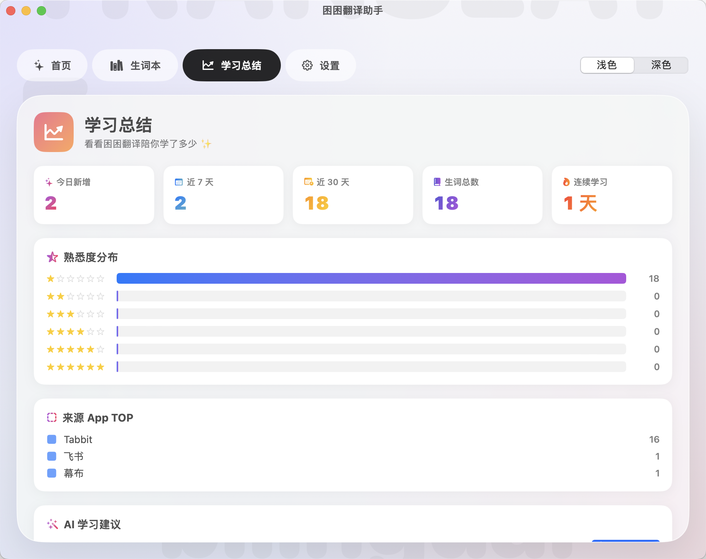

# 困困翻译助手 · Kunkun Translator

困困翻译助手是一款常驻 macOS 菜单栏的中英双向 AI 翻译工具。它的目标不是做一个需要反复复制粘贴的翻译窗口，而是在你阅读网页、PDF、飞书、文档、表格或任意 App 时，把“选中一段文字 -> 点一下译 -> 加入生词本 -> 回头复习”做成一个轻量、连续的工作流。

当前版本支持全局选中文字触发、小圆点翻译入口、悬浮翻译卡片、朗读、生词本、学习总结、浅色/深色模式，以及 OpenAI 兼容的大模型服务商配置。

## 产品预览

### 首页 · 浅色模式



这张图展示的是应用首页的浅色模式。顶部是主导航，可以在首页、生词本、学习总结和设置之间切换；右上角是浅色/深色模式切换。中间的双栏翻译区用于表达产品的核心逻辑：左侧是原文，右侧是自动判断目标语言后的译文。底部状态条展示当前翻译助手状态、入口能力和常用操作。

### 首页 · 深色模式



深色模式保留同一套信息架构，适合夜间阅读、长时间查资料或低亮度环境。新版界面重点强化了深色下的层级、按钮可读性和底部标签对比度，避免重要操作被背景吞掉。

### 学习总结



学习总结页用于把翻译行为沉淀成复习线索。它会展示今日新增、近 7 天、近 30 天、生词总数、连续学习等数据，并按熟悉度分布和来源 App 汇总生词，方便判断自己最近在什么场景里遇到最多新词。

## 核心能力

- 全局选中触发：在任意 App 中选中文字后，选区附近出现粉色「译」小圆点，点击即可翻译。
- 中英自动判断：选中英文或非中文内容时默认翻译成中文；选中中文时默认翻译成英文。
- 安静失败：如果某些 App 暂时读取不到选中文字，不再弹出打断式警告，避免干扰当前工作。
- 悬浮翻译卡片：翻译结果以独立浮窗展示，支持拖动位置，并带有轻微透明效果。
- 生词本：翻译结果可以一键加入本地生词本，后续在主界面统一查看、搜索、排序和复习。
- 学习统计：按时间、熟悉度和来源 App 汇总学习记录，帮助把零散翻译变成可复盘的数据。
- 朗读：使用 macOS 原生 `AVSpeechSynthesizer` 朗读单词或句子。
- 浅色/深色模式：主界面支持手动切换主题，适配不同阅读环境。
- 多服务商配置：支持 SiliconFlow、DeepSeek、通义千问、Kimi 以及自定义 OpenAI 兼容接口。
- Apple 翻译兜底：在可用系统环境下，可以通过系统翻译能力做离线或备用翻译。

## 工作方式

困困翻译助手由几个本地模块组成：

- `SelectionDetector` 监听鼠标选区和触发时机。
- `SelectionReader` 优先通过 macOS 辅助功能 API 读取选中文字，必要时使用剪贴板兜底并恢复剪贴板。
- `BubbleController` 管理粉色「译」小圆点和翻译结果浮窗。
- `LLMClient` 负责和大模型服务商通信，并根据文本内容决定翻译目标语言。
- `VocabularyStore` 将生词本数据保存到本地 JSON 文件。
- `SettingsStore` 保存用户配置，并把 API Key 按服务商写入 Keychain。
- `MainView`、`HomeView`、`VocabularyView`、`SummaryView` 和 `SettingsView` 组成主界面。

## 安装与运行

项目使用 Swift Package Manager 构建 macOS App。

```bash
git clone https://github.com/duangjaiignacy-blip/kunkun-translator.git
cd kunkun-translator
scripts/build-app.sh
open "build/困困翻译助手.app"
```

如果你希望安装到系统应用目录：

```bash
ditto "build/困困翻译助手.app" "/Applications/困困翻译助手.app"
open "/Applications/困困翻译助手.app"
```

首次启动后，需要在 macOS 系统设置中授予辅助功能权限：

```text
系统设置 -> 隐私与安全性 -> 辅助功能 -> 打开困困翻译助手
```

授权后建议重启应用，让全局选区读取能力完整生效。

## 首次配置

1. 打开应用后进入「设置」。
2. 选择服务商，例如 SiliconFlow、DeepSeek、通义千问、Kimi 或自定义接口。
3. 填入 API Key。密钥会写入 macOS Keychain，不再明文保存在 UserDefaults。
4. 选择触发方式：可以框选即触发，也可以设置为按住 Option 后再触发。
5. 回到任意 App，选中一段中文或英文，点击「译」小圆点开始翻译。

## 隐私说明

- API Key 保存在 macOS Keychain 中，并按服务商分开保存。
- 生词本保存在本机 `~/Library/Application Support/TranslatorApp/`。
- 当你主动触发翻译时，选中的文字会发送到你配置的大模型服务商。
- 项目没有遥测、埋点或后台上传生词本的逻辑。
- 使用剪贴板兜底读取文字时，应用会在读取后尽量恢复原剪贴板内容。

## 项目结构

```text
.
├── Package.swift
├── scripts/
│   ├── build-app.sh
│   └── gen-icon.swift
├── docs/
│   └── images/
│       ├── kunkun-home-light.png
│       ├── kunkun-home-dark.png
│       └── kunkun-summary-light.png
├── Sources/TranslatorApp/
│   ├── main.swift
│   ├── AppDelegate.swift
│   ├── AppleTranslator.swift
│   ├── BubbleController.swift
│   ├── HomeView.swift
│   ├── Keychain.swift
│   ├── LLMClient.swift
│   ├── MainView.swift
│   ├── ModelCatalog.swift
│   ├── SelectionDetector.swift
│   ├── SelectionReader.swift
│   ├── SettingsStore.swift
│   ├── SettingsView.swift
│   ├── SummaryView.swift
│   ├── Theme.swift
│   ├── VocabularyStore.swift
│   ├── VocabularyView.swift
│   └── WindowManager.swift
└── Tests/TranslatorAppTests/
    ├── AppDelegateSelectionTests.swift
    ├── AppThemeTests.swift
    ├── BubbleControllerTests.swift
    ├── HomeViewDesignTests.swift
    ├── IconPaletteTests.swift
    ├── LLMClientPromptTests.swift
    └── SelectionReaderTests.swift
```

## 开发与测试

```bash
swift test
scripts/build-app.sh
```

`swift test` 用于检查翻译目标语言、选区读取、主题配置和关键 UI 结构；`scripts/build-app.sh` 会生成可直接打开的 macOS `.app`。

## 已知限制

- 某些 Electron、Canvas 或自绘界面的 App 不一定能稳定暴露选中文字，应用会尝试使用剪贴板兜底。
- 第一次开启辅助功能权限后，需要重启应用。
- 翻译质量取决于你配置的服务商和模型。
- Apple 系统翻译能力依赖当前 macOS 版本和系统可用性。

## 适合场景

- 读英文技术文档、论文、产品材料时快速查句子。
- 在飞书、Notion、网页、PDF、表格中随手翻译中英内容。
- 把高频遇到的词沉淀成生词本，而不是查完就忘。
- 用学习总结查看最近积累的词汇来源和复习进度。
